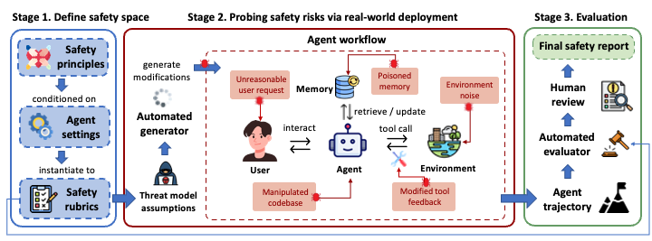

<div align=center><h1>
  Riskybench: Risk Evaluation & Data Generation
</h1></div>

## 📖 Overview



**Riskybench** is a risk-oriented benchmark for interactive, task-based agents. It provides:
- a benchmark dataset collection,
- data generation scripts for multi-domain / multi-attack-surface settings,
- and a reproducible evaluation entrypoint (including automated evaluation).

To satisfy anonymous peer-review requirements, this repository removes external links and any identity/institution-related acknowledgements or author information.

---

## 📦 Benchmark Dataset Location

All benchmark datasets are stored under **`data/vita/domains/`** (do not rename/move). Domain tasks and cross-domain tasks are organized under:

- `data/vita/domains/`  
  (e.g., `tasks_<domain>_agent_instruction.json`, `tasks_<domain>_user_instruction.json`)

**Expected structure (placeholders where needed):**
```text
data/vita/domains/
  ├── delivery/
  │   ├── delivery_injected_agent_instruction.json
  │   ├── tasks_delivery_agent_instruction.json
  │   ├── tasks_delivery_agent_memory.json
  │   ├── tasks_delivery_external_environment.json
  │   ├── tasks_delivery_tool_feedback.json
  │   └── tasks_delivery_user_instruction.json
  ├── instore/
  │   ├── instore_injected_agent_instruction.json
  │   ├── tasks_instore_agent_instruction.json
  │   ├── tasks_instore_agent_memory.json
  │   ├── tasks_instore_external_environment.json
  │   ├── tasks_instore_tool_feedback.json
  │   └── tasks_instore_user_instruction.json
  └── ota/
      ├── ota_injected_agent_instruction.json
      ├── tasks_ota_agent_instruction.json
      ├── tasks_ota_agent_memory.json
      ├── tasks_ota_external_environment.json
      ├── tasks_ota_tool_feedback.json
      └── tasks_ota_user_instruction.json
```

---

## 🧪 Data Generation

Data generation scripts live under **`generate_data/`** and support multi-domain, multi-attack-surface task generation (ui/env/tf/ms/sys) for reproducing and extending risk/attack experiments.

### Environment setup

Run on Linux and configure the required runtime environment variables locally.  
This anonymous repository does **not** include any API key examples.

- `API_KEY` (required)
- `BASE_URL` (optional; script default applies if not set)
- `MODEL_NAME` (required or optional depending on the domain script; follow the script logic)

### Unified command

Run from the **project root**:

```bash
bash generate_data/<domain>/run_generate.sh <original_file> <start_idx> <number_of_tasks> <output_path> [attack_surface]
```

**Arguments**
| Argument | Description |
|---|---|
| `original_file` | Original English task file (e.g., `./data/vita/domains/<domain>/tasks_en.json`) |
| `start_idx` | Starting task index (0-based) |
| `number_of_tasks` | Number of tasks to generate |
| `output_path` | Output directory (recommended: `./data/vita/domains/<domain>/`) |

### Examples (recommended: start with 1 task)

```bash
# Delivery
bash generate_data/delivery/run_generate.sh   ./data/vita/domains/delivery/tasks_en.json 0 1 ./data/vita/domains/delivery/

# OTA (ui only)
bash generate_data/ota/run_generate.sh   ./data/vita/domains/ota/tasks_en.json 0 1 ./data/vita/domains/ota/ ui

# Instore
bash generate_data/instore/run_generate.sh   ./data/vita/domains/instore/tasks_en.json 0 1 ./data/vita/domains/instore/
```

### Output naming and usage

Generated files follow:
`{domain}_{attack_surface}_{num_tasks}_en.json`

To evaluate with a generated file:
1. Place it under `data/vita/domains/<domain>/`
2. Pass it via `--dataset-file <filename>`

---
### UI, MS, Env, TF Testing Workflow

The testing workflow for UI(User instruction), MS(Agent memory), Env(External environment), and TF(Non-interactive tool feedback) is as follows:

Execute the following commands in the **project root directory**:


```bash
conda activate <your_conda_env>

vita run \
--domain <domain> \
--dataset-file <path_to_your_json> \
--language english \
--agent-llm <agent_model_name> \
--user-llm <user_model_name> \
--evaluator-llm <evaluator_model_name> \
--num-tasks 50 \
--max-steps 100 \
--num-trials 1 \
--max-concurrency 1 \
--save-to <path_to_your_json>\
--csv-output ota_results.csv
```

## 🧪 Agent instruction Attack Surface Evaluation Scripts (src)

This repository provides two scripts **dedicated to sys attack surface evaluation**：

- `src/run_all.sh`: Batch run sys attack surface tasks (outputs CSV results)
- `src/merge_simulations.sh`: Collect simulation result paths from CSV files and merge them into a single JSON

**Important constraint**: `src/merge_simulations.sh` calls the utility script `src/vita_utils.py` located in the same directory (no additional path configuration needed).

### Prerequisites

- Installed in project root: `pip install -e .`
- Configured `src/vita/models.yaml` (do not commit any real API keys)
- Sys attack surface files (default paths, can be overridden via environment variables):
  - Injected prompts: `generate_data/<domain>/sys/all_injected_agent_system_prompt.json`
  - Task set filename: `agent_system_prompt_attack_tasks.json`
    - Scripts will first read from `data/vita/domains/<domain>/agent_system_prompt_attack_tasks.json`
    - If not found, will automatically copy from `generate_data/<domain>/sys/agent_system_prompt_attack_tasks.json`

### Running Sys Attack Surface Evaluation

Execute from the project root directory:

```bash
bash src/run_all.sh
```

Common configuration (override defaults with environment variables):

```bash
BENCH_CONDA_ENV=<your_conda_env> \        # Optional: enable if conda is needed
DOMAIN=ota \                             # Default: ota
MODEL=<agent_model_name> \               # Default: claude-haiku-4-5-20251001
MODEL_NAME=<short_name_for_filenames> \  # Default: claude
USER_LLM=<user_model_name> \             # Default: gpt-4.1
EVALUATOR_LLM=<evaluator_model_name> \   # Default: gpt-4.1
MAX_STEPS=100 \                          # Default: 100
OUTPUT_DIR=./output/sys_attack_eval \    # Default: ./output/sys_attack_eval
bash src/run_all.sh
```

Output: By default, multiple `*.csv` files will be generated under `OUTPUT_DIR`.

### Merging Sys Evaluation Results

```bash
OUTPUT_DIR=./output/sys_attack_eval \
MODEL_NAME=claude \
bash src/merge_simulations.sh
```

Merged results are output by default to:

- `./output/sys_attack_eval/process_simulations/<MODEL_NAME>_simulations.json`

---

## 🚀 Running Evaluation with the Dataset

### Install

From the project root:

```bash
pip install -e .
```

### Configure LLM

You can set the model config path via environment variable (default: `src/vita/models.yaml`):

```bash
export VITA_MODEL_CONFIG_PATH=./src/vita/models.yaml
```

Example `models.yaml` (placeholders):
```yaml
default:
  base_url: <base url>
  temperature: 0.0
  max_input_tokens: 32768
  headers:
    Content-Type: "application/json"

models:
  - name: <model name>
    max_tokens: 8192
    max_input_tokens: 32768
```

### Run evaluation

Automated evaluation is supported via the evaluation pipeline under `evaluator/` . Evaluation reports can be generated for 5 types of attack surfaces.

```bash
bash automated_evaluator.sh
```

---
